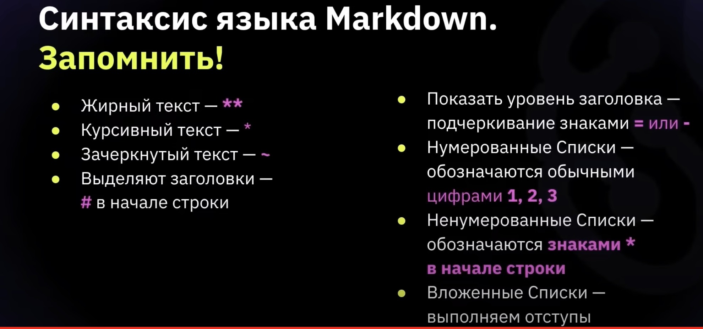

# Инструкция для работы с Markdown

## Заголовки

Чтобы обозначить заголовок необходимо определить тип заголовка. Главный заголовок задаётся с помощью знака (#), к примеру:
># Заголовок H1
Заголовки поменьше задаются двумя и более знаками решёток, например:
>1. ## Заголовок Н2
>2. ### Заголовок Н3
>3. #### Заголовок H4
>4. ##### Заголовок H5
>5. ###### Заголовок H6

## Выделение текста

Чтобы выделить текст курсивом необходимо выделить его звёздочками (*) или знаком нижнего подчёркивания. Например, *вот так* или _вот так_

Чтобы выделить текст полужирным необходимо выделить его 2 звёздочками (**) или двойным знаком нижнего подчёркивания. Например, **вот так** или __вот так__

Альтернативные способы выделения текста жирным или курсивом, чтобы мы могли выделять текст двумя способами. Например _текст может быть выделен курсивом и при этом быть **полужирным**_.

## Работа с изображениями

Картинки в MarkDown можно добавить следующими способами:

1. Добавление картинки в качестве ссылки, например:

["Это ссылка на картинку"](https://klike.net/1706-skachat-kartinki-horoshego-kachestva-50-foto.html)
```
["Это картинка"](https://klike.net/1706-skachat-kartinki-horoshego-kachestva-50-foto.html), 
где [] - это заголовок, а в скобках () указана ссылка на картинку.
```

2. Добавление картинки из папки с файлом:

```
 
- где в квадратных скобках указываем название файла, а в закруглённых адрес файла.
```


## Списки

Чтобы добавить ненумерованные списки необходимы выделить пункты звёздочками (*). Например вот так:
* Элемент 1
* Элемент 2
* Элемент 3

Чтобы добавить нумерованные списки необходимы просто пронумеровать. Например вот так:
1. Элемент 1
2. Элемент 2
3. Элемент 3

## Работа с таблицами 

## Цитаты

## Заключение